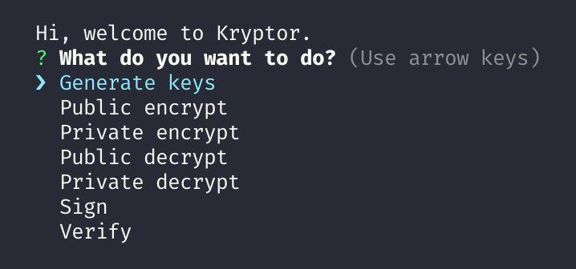

# Kryptor

[](https://travis-ci.com/GillianPerard/kryptor)
[](https://snyk.io/test/github/GillianPerard/kryptor?targetFile=package.json)

A CLI to generate RSA key (private and public), public encrypt, private decrypt, private encrypt, public decrypt, sign & verify.

## Getting Started

These instructions will help you to get this project on your own machine and run the 7 available commands.

### Prerequisites

The only thing you must have is NodeJs 10.14+.

Check the NodeJs documentation to know how to install it: [https://nodejs.org](https://nodejs.org)

### Installing

To get the project run the following commands:

```sh
git clone https://github.com/GillianPerard/kryptor.git
```

Then run the npm command to install all dependencies:

```sh
npm ci
```

Now normally, everything should be ready to use.

## Usage (CLI)

Go to the project folder then go to src folder.

There you can run the following commands.

### Help

To display the documentation:

```sh
node kryptor -h
# or
node kryptor --help
```

### Generate key pair

To generate private and public keys into the desired folder with the desired key size (**private.pem** and **public.pem**):

```sh
Command:
    generate | g <keySize>          [Required] Key size in bits

Options:
    -e, --export <destFolder>       [Required] Destination folder
    -h, --help                       Output usage information


# Example: node krypto generate 2048 -e .
```

### Encrypt **with a public key**

To encrypt a text with a public key (*encoding: base64*):

```sh
Command:
    public-encrypt | pcet

Options:
    -p, --publicKey <path>          [Required] Path of the public key
    -f, --fileToEncrypt <path>      [Required] Path of the file to encrypt
    -e, --export <path>             [Required] Path of the encrypted file
    -h, --help                       Output usage information


# Example: node krypto public-encrypt -p public.pem -f file.txt -e file.enc
```

### Decrypt **with a private key**

To decrypt an encrypted text with a private key which matches with a public key (*from encoding: base64*):

```sh
Command:
    private-decrypt | pedt

Options:
    -p, --privateKey <path>       [Required] Path of the private key
    -f, --fileToDecrypt <path>    [Required] Path of the file to decrypt
    -e, --export <path>           [Required] Path of the decrypted file
    -h, --help                     Output usage information


# Example: node krypto private-decrypt -p private.pem -f file.enc -e file.txt
```

### Encrypt **with a private key**

To encrypt a text with a private key (*encoding: base64*):

```sh
Command:
    private-encrypt | peet

Options:
    -p, --privateKey <path>       [Required] Path of the private key
    -f, --fileToEncrypt <path>    [Required] Path of the file to encrypt
    -e, --export <path>           [Required] Path of the encrypted file
    -h, --help                     Output usage information


# Example: node krypto private-encrypt -p private.pem -f file.txt -e file.enc
```

### Decrypt **with a public key**

To decrypt an encrypted text with a public key which matches with the private key (*from encoding: base64*):

```sh
Command:
    public-decrypt | pcdt

Options:
    -p, --publicKey <path>        [Required] Path of the public key
    -f, --fileToDecrypt <path>    [Required] Path of the file to decrypt
    -e, --export <path>           [Required] Path of the decrypted file
    -h, --help                     Output usage information


# Example: node krypto public-decrypt -p public.pem -f file.enc -e file.txt
```

### Sign

To create a signature for a given file.

```sh
Command:
    sign | s

Options:
    -p, --privateKey <path>        [Required] Path of the private key
    -f, --fileToSign <path>        [Required] Path of the file to sign
    -e, --export <path>            [Required] Path of the signature
    -h, --help                      Output usage information

# Example: node krypto sign -p private.pem -f file.txt -s file.sign
```

### Verify

To verify that a file is not forged thanks to the signature file.

```sh
Command:
    verify | v

Options:
    -p, --publicKey <path>         [Required] Path of the public key
    -f, --fileToVerify <path>      [Required] Path of the file to verify
    -s, --signature <path>         [Required] Path of the signature
    -h, --help                      Output usage information

# Example: node krypto verify -p public.pem -f file.txt -s file.sign
# Returns: 'Verified OK' or 'Verified Failure'
```

## Usage (program)

Instead of use the CLI if you don't know how to or just because you think it's boring to remember you all options; you can use Kryptor thanks to the **easy-kryptor.js** file.

Run the one of the following commands to start the program and follow the instructions:

### From the root directory

```sh
npm start
```

### From the src directory

```sh
node easy-kryptor
```

Example:



## Testing

For the moment there is only one test that checks all command from kryptor.js.

To run it, use the following command from the root directory:

```sh
npm test
```

## Author

**Gillian Pérard** - *Creator* - [GillianPerard](https://github.com/GillianPerard)

## License

This project is licensed under the MIT License - see the [LICENSE](LICENSE) file for details